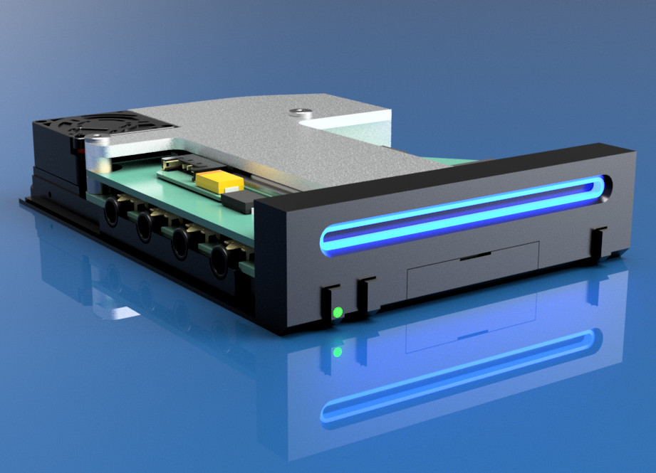

  <h1>
    
    
  </h1>

  <h4>World's Smallest Nintendo Wii, using a trimmed motherboard and custom stacked PCBs</h4>

  

    <a href="#features">Features</a> &middot;
    <a href="#size--scale">Size & Scale</a> &middot;
    <a href="#components">Components</a> &middot;
    <a href="#build-guide">Build Guide</a>
  

## Features

- World's smallest "to scale" Wii console
- Powered by USB-C
- HDMI for lossless digital audio and video (powered by [GCVideo](https://github.com/ikorb/gcvideo))
- Bluetooth for Wii remotes and accessories
- MicroSD card stores games and saves, instead of disc drive & memory cards
- 4 GameCube controller ports
- Power, reset, and sync buttons
- Power indicator LED and iconic blue glowing disc slot
- Soft shutdown, power on/off via Wiimote

## Size & Scale

This is a **1:2.38 scale** model of an original Nintendo Wii console, but since that is hard to visualize here are some other stats:

- Same size as a typical deck of playing cards
- **7.4% the volume** of an original Wii console
- You could fit **13.5** of these inside an original Wii

I'm pretty sure this sets the record for the smallest functional scale-model Wii console, but let me know if I'm wrong!

### Could we go smaller?

Yes! It is definitely possible to go smaller than this. My [version of the Omega trim](images/trim.png) keeps all four main mounting holes, which makes it around 7mm wider than a classic Omega trim. Additionally [Wesk](https://twitter.com/Weskmods) has managed to get a Wii motherboard down to 52x52mm on his final destination trim, which is a a full 10mm narrower than my trim. I estimate you could reduce the volume by a further 25-30% without losing any functionality, but it would be an incredibly tight fit and tricky to assemble.

## Components

As the name implies, *Short Stack* is built from a stack of custom PCBs, and a custom heatsink, that are all designed to fit together in a compact and modular way.

### A modular motherboard

Making a tiny build like this is made possible by trimming the Wii motherboard down to the bare essentials. The result is a board which is just *62x62mm*, but still contains the CPU, GPU, RAM and flash memory.

 

Since we removed the original power circuitry and trimmed off the USB, Bluetooth, and GameCube connectors, we need to provide power and data to the board another way. I designed a couple of boards which solder directly to the front of a trimmed Wii motherboard to provide power and data, which help avoid a tangled mess of wires.

The [Wii Power Strip](https://github.com/loopj/wii-power-strip) supplies power to the Wii motherboards using a Molex Pico-Lock connector, and additionally has footprints to help relocate of a couple of capacitors which are typically removed when trimming a Wii.

[Periphlex](https://github.com/loopj/periphlex) is a flex PCB which breaks out the Bluetooth, USB and GameCube controller data lines, as well as the power, shutdown, and reset GPIOs. These are then made available via a 14-pin FFC connector. This approach replaces 11 magnet wires with a single, removable ribbon cable.

On the back of the motherboard, I'm using two open-source boards designed by the very talented [YveltalGriffin](https://github.com/mackieks). [fujiflex](https://github.com/mackieks/fujiflex) provides digital A/V output using GCVideo, and [nandFlex](https://github.com/mackieks/nandFlex) relocates the Wii's NAND memory chip, to enable the tight trim.

### Custom PCBs

In addition to the modular boards on the motherboard, I designed two PCBs specific to Short Stack which provide the rest of the functionality for the console.

The *main board* PCB hosts the power regulators, USB to microSD logic, HDMI connector, GameCube ports, and a microcontroller for power management. A 14-pin ribbon cable connects this board to the Wii motherboard via *Periphlex*, and a power cable delivers power to the *Power Strip*.

The *front panel* PCB hosts the power, reset, and sync buttons, as well as the power LED and disc slot LEDs. This board connects to the main board via a short 8-pin ribbon cable.

### Cooling

The final part of the "stack" is a custom heatsink which is designed to be as low profile as possible, while still providing adequate cooling for the Wii's CPU and GPU. The heatsink is designed to be machined from aluminum or copper, and incorporates mounting holes which align with those on the Wii motherboard.

I managed to find a tiny 5V blower fan ([Pelonis AGB208N](https://catalog.pelonistechnologies.com/item/air-g-series-micro-fans-and-micro-blowers/micro-fans-and-micro-blowers/agb208n)) which measures just 20x20x8mm and somehow puts out 0.84 CFM of air. This blows air through the heasink fins, out the side of the case.

### Case

The stack is housed in a custom 3D printed case, secured with four M2.5 screws and spacers. The rest of case is assembled using self-tapping M1.2 screws. The screw locations and fan vents are positioned to match the original Wii case as closely as possible, to minimize visible screws.

You can access files on the SD card by connecting the console to a computer via USB, but I also included an access panel on the front of the case where the original Wii SD card slot is found. This panel is held in place by magnets and can be removed to access the SD card without opening the case. Shout out to Wesk for the magnet idea!

To keep the clean aesthetic of the original Wii I wanted to hide the GameCube controller ports behind a panel. I always hated the hinged design of the original, and it is quite difficult to replicate at this scale, so I redesigned this panel to be a sliding panel.

The Wii's iconic disc slot lights are recreated using a 1.5mm thick custom cut acrylic light diffuser, which is illuminated by two side-mounted addressable LEDs on the front panel board. The power, reset, and sync buttons are all also 3D printed, and the power button hosts a tiny light pipe to allow the power LED to shine through.

I FDM printed the case on a Voron 2.4 in ABS using a 0.4mm nozzle at 0.1mm layer height, but it should print fine in PLA or PETG on a well-tuned printer. At this scale, dimensional accuracy is important. In theory it should be possible to print this on an SLA printer, but I haven't tried it.

## Build Guide

> [!CAUTION]
> This is not a beginner project! This build requires performing a challenging motherboard trim, fine pitch soldering, and PCB assembly. If you are not comfortable with these tasks, I would recommend starting with a simpler project and working your way up - check out the [BitBuilt forums](https://bitbuilt.net) for some awesome project worklogs.

### What you'll need

- 4-layer Wii motherboard
- [nandFlex](https://github.com/mackieks/nandFlex) board (or [4Layer Technologies RVL-NAND](https://4layertech.com/products/rvl-nand-flex-board-pack-of-2))
- Assembled [fujiflex](https://github.com/mackieks/fujiflex) (or [ElectronAVE](https://electron-shepherd.com/products/electronave-kit))
- Assembled [Wii Power Strip](https://github.com/loopj/wii-power-strip/tree/r1) - **must be revision 1!**
- Assembled [Periphlex](https://github.com/loopj/periphlex)
- [Short Stack main board](main-board/KiCad) - 1.2mm thickness, stencil recommended
- [Short Stack front panel](front-panel/KiCad) - 0.8mm thickness, black soldermask, stencil recommended
- [Heatsink](case/heatsink.step) - machined from aluminum or copper
- [Light diffuser](case/disc-light-diffuser.dxf) - cut from 1.5mm thick acrylic
- The components and hardware from the [bill of materials](full-bom.xlsx)

### Assembly

- Assemble main board and front panel PCBs
  - I recommend using a solder stencil and a hot plate or reflow oven
  - If using a hot plate, hand solder the headphone connectors after reflowing the rest of the components
  - Secure two 3 x 1mm magnets inside the holes on the front panel board using a dab of CA glue
- Flash the [main board firmware](main-board/firmware)
- Prepare and trim the Wii motherboard
  - Relocate the NAND, test it still boots
  - Perform a wireless U10 relocation, test it still boots - you may wish to wire a magnet wire to the [`SHUTDOWN` via](https://bitbuilt.net/forums/index.php?threads/soft-shutdown-power-on-via-bluetooth.6239/) first
  - Install fujiflex, and test digital A/V output works
  - Trim the motherboard (see [trim dimensions](images/trim.png))
- Assemble and install *Power Strip* ([see instructions](https://github.com/loopj/wii-power-strip/tree/r1#installation))
- Assemble and install *Periphlex* ([see instructions](https://github.com/loopj/periphlex#installation))
- Connect the boards
  - Connect the main board to the motherboard via a 14-pin FFC cable to *Periphlex*
  - Connect the main board to the motherboard via a 5-pin Molex Pico-Lock cable to *Power Strip*
  - Connect the front panel board to the main board via an 8-pin FFC cable
  - Connect the fan to the main board
  - Apply thermal paste to the CPU and GPU
  - Stack the components: heatsink, motherboard, M2.5 x 3mm spacers, main board
  - Install the stack to the case bottom using M2.5 x 12mm wafer head screws
- Secure the top of the case to the bottom using four M1.2 x 4mm screws
- Secure the front panel PCB to the front of the case using two M1.2 x 3mm screws
- Secure the front of the case to the bottom of the case using two M1.2 x 4mm screws
- Press-fit two 3 x 1mm magnets into the holes on the sd card cover, make sure they match polarity with the magnets on the front panel PCB
- Slide the side panel into the case

## License

Permissively released under the Solderpad Hardware License v2.1
